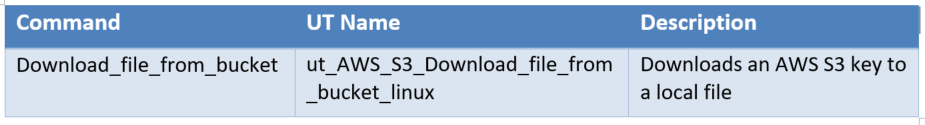
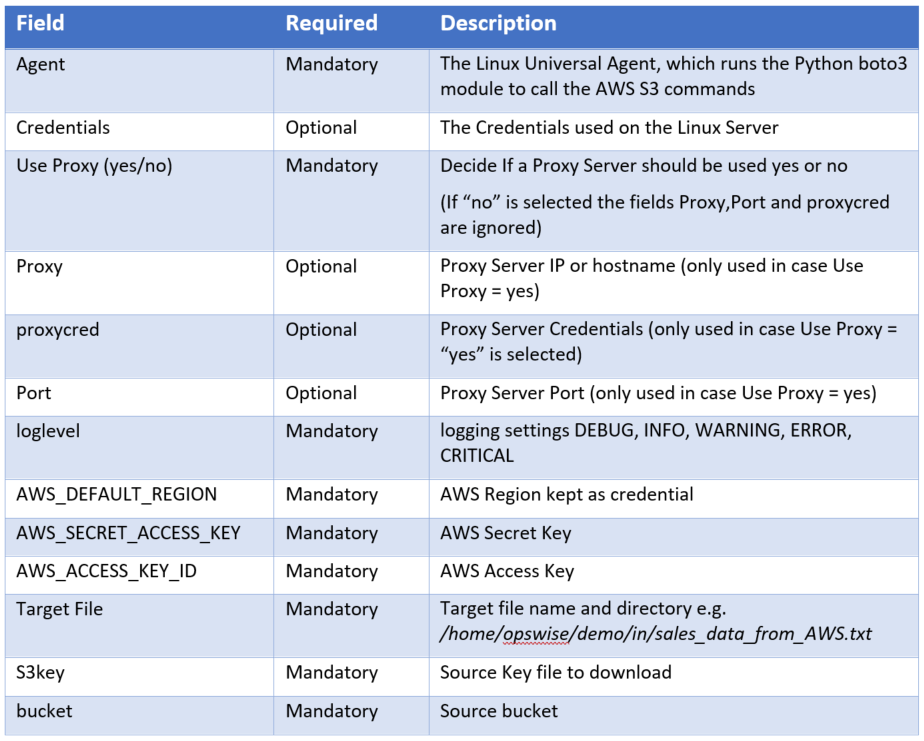

# ut-aws-s3-monitor-key-in-bucket-linux
# Abstract: 

The here described Universal Tasks allow to Transfer and retrieve files from Amazon AWS S3. As a result, you can integrate any AWS S3 file transfers into you existing or new scheduling workflows, providing a true hybrid cloud (on-premise and cloud computer) file transfer solution.  

# 1	Disclaimer

No support and no warranty are provided by Stonebranch GmbH for this document and the related Universal Task. The use of this document and the related Universal Task is on your own risk. 

Before using this task in a production system, please perform extensive testing.

Stonebranch GmbH assumes no liability for damage caused by the performance of the Universal Tasks

# 2	Scope 

This document provides a documentation how to install and use the Universal Tasks for AWS S3 File Transfers. If more Task will be created in the future this document will be updated accordingly.  

# 3	Introduction

Storing data in the cloud becomes an integral part of most modern IT landscapes. With Universal Automation Center you can securely automate your AWS, Azure or any other Cloud File Transfer and integrate them into your existing scheduling flows.

As security is one of the key concerns, when moving to the cloud, the provided solution supports multi-level of security:

- All Credential for AWS S3 (Access Key, Secret Access key and Region) are stored in an encrypted form in the database
- Connections towards the AWS VPC via a Proxy Server are supported
- Secure access to AWS S3 buckets using AWS bucket policies can be configured
- Restrict sending files only to specific buckets using AWS End Points

The here described Series of Universal Tasks focuses on the AMAZON AWS S3 file transfer. A similar solution as for AWS S3 is also available for Microsoft Azure. 

Some details about the universal tasks for AWS S3:

- The Universal Tasks are calling the python module Boto3 - the Amazon Web Services (AWS) SDK for Python. Both Boto3 API Types are used the "low-level" Client API and Resource APIs. 
- The python boto3 module is called by a Universal Agent running on a Linux Server or Windows Server – Note: This document focuses on the Linux Version 
- The Server Running the Universal Agent needs to have Python 2.7.x or 3.6.x installed
- All Universal Task support encrypted connections via a Proxy Server
-	All Credential for AWS S3 (Access Key, Secret Access key and Region) are stored in an encrypted form in the database
-	You can configure all connection Parameters for the Proxy and AWS via the Universal Task
-	You can select different log-levels e.g. Info and debug

The following Universal Task for AWS S3 have been implemented: 

Image 1

# 4	Installation
# 4.1	Software Requirements

**Universal Task name:** ut-aws-s3-monitor-key-in-bucket-linux
**Related UAC XML Files for template and task:** Github repository

**Software used:**

For the set-up you need:

1.  	Python 2.7.x (or 3.6.x) for Linux installed on a server where a Universal Agent is installed. 
2.  	For Python the following modules are required: 
      -  Re, to support regular expression matching operations 
      -  glob, to find Unix pathnames matching a specified pattern
      -  os, to support operating system dependent commands
      -  sys, for output re-direct processing 
      -  datetime, date and time stamps for messages
      -  logging, to provide logging capabilities for debug, info etc.
      -  boto3, provide the Amazon Web Services (AWS) SDK for Python
      -  botocore, Botocore is a low-level interface to a growing number of Amazon Web Services. Botocore serves as the foundation for the AWS-CLI command line utilities. 
      -  argparse, to allow testing of the Universal TPL. script on the command line
      
Note: Only the module boto3 and botocore need to be added to python 3.6.x. e.g. using pip.
-pip install boto3
-pip install botocore

3.  	Universal Controller 6.4.5.x or higher
4.  	Universal Agent 6.4.2.2 or higher installed on a Linux Server
5.  	An Amazon AWS account to try it out

# 4.2	Installation Steps

The following describes the installation steps:

**1.	  Install Python 2.7.x or 3.6.x for Linux on the Universal Controller server or any Linux Server running a Universal Agent.** 

Official Download link: 17TUhttps://www.python.org/downloads/U17T

Note: 

In most cases python is already available on Linux. Check availability with: python -V

**2.	  17TAdd the boto3 and botocore modules to your python installation**

In a command shell run as root or sudo:

-   pip install boto3
-   pip install botocore

**3.	  Import each AWS S3 Universal Task including the Universal Template to your Controller**

Go to “All Tasks” and load via the Import functionality the Universal Task configuration into the Controller. 

Image2

# 5	Universal Task Configuration
**1. Activate: Resolvable Credentials in Universal Automation Center:**

Image3

 
**2.	Fill Out the Universal Task for each AWS command, which you want to execute:**

In the example below the S3 Boto3 Create Bucket Task was selected

Image4

**Fill out or select the required Credentials for AWS and optionally a Proxy Server** 

In the example below the AWS_SECRET_ACCESS_KEY credentials are shown:

Image5

# 6	Universal Tasks for AWS S3

The following chapter describes the provided AWS S3 Universal Tasks.

# 6.1	Create_Bucket

Image6

**Task Screenshot**

Image7

**Field Description:**

Image8

# 6.2	Monitor_key_in_bucket

Image9

**Task Screenshot**

Image10

**Field Description:**

Image11

# 6.3	Copy_file_to_bucket

Image12

**Task Screenshot**

Image13

**Field Description:**

Image14

# 6.4	List_keys_in_bucket

Image15

**Task Screenshot**

Image16

**Field Description:**

Image17

# 6.5	Download_file_from_bucket

Image18

**Task Screenshot**

Image19

**Field Description:**

Image20

# 6.6	Delete_key_from_bucket

Image21

**Task Screenshot**

Image22

**Field Description:**

Image23

# 6.7	Delete_empty_bucket

Image24

**Task Screenshot**

Image25

**Field Description:**

Image26

# 6.8	List_buckets

Image27

**Task Screenshot**

Image28

**Field Description:**

Image29

# 6.9	Check_for_key_in_buckets

Image30

**Task Screenshot**

Image31

**Field Description:**

Image32

# 7	Test Cases

The following basic test cases has been performed:

Image33

Image34

# 8	Document References

There are no document references.

      

